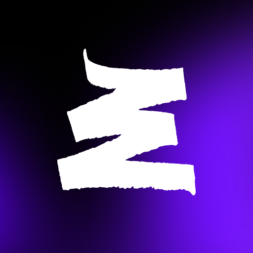

<!-- # Привет, меня зовут Дарья 👋 -->

<!-- Я QA Engineer с техническим образованием, который увлечён качеством программного обеспечения, процессами тестирования и постоянным развитием. -->

## 🛠 Проекты // Projects //FIXME: Добавить

<!-- | Проект   | Артефакты                  | Технологический стек                                                                                                                                                                                                                                                                                                                                                                                                                                                                                                                   | Описание |
| -------- | -------------------------- | -------------------------------------------------------------------------------------------------------------------------------------------------------------------------------------------------------------------------------------------------------------------------------------------------------------------------------------------------------------------------------------------------------------------------------------------------------------------------------------------------------------------------------------- | -------- |
| Название | Ссылка 1 Ссылка 2 Ссылка 3 |      | Описание | -->

## 🛠 Технологии // Tech Stack

<!--  -->

<!--  -->

## 🛠 Тестовая документация // Test Artifacts //FIXME: Добавить

- [Чек-листы](https://github.com/PhOeNiX423/checklists)
- [Баг-репорты]()
- [Ментальные карты]()

## 📫 Контакты // Contacts

🐱 GitHub: https://github.com/PhOeNiX423

✉️ E-mail: dariavolkova.qa@yandex.ru

## 💬 Социальные сети // Socials //FIXME: Добавить

    
    
  

